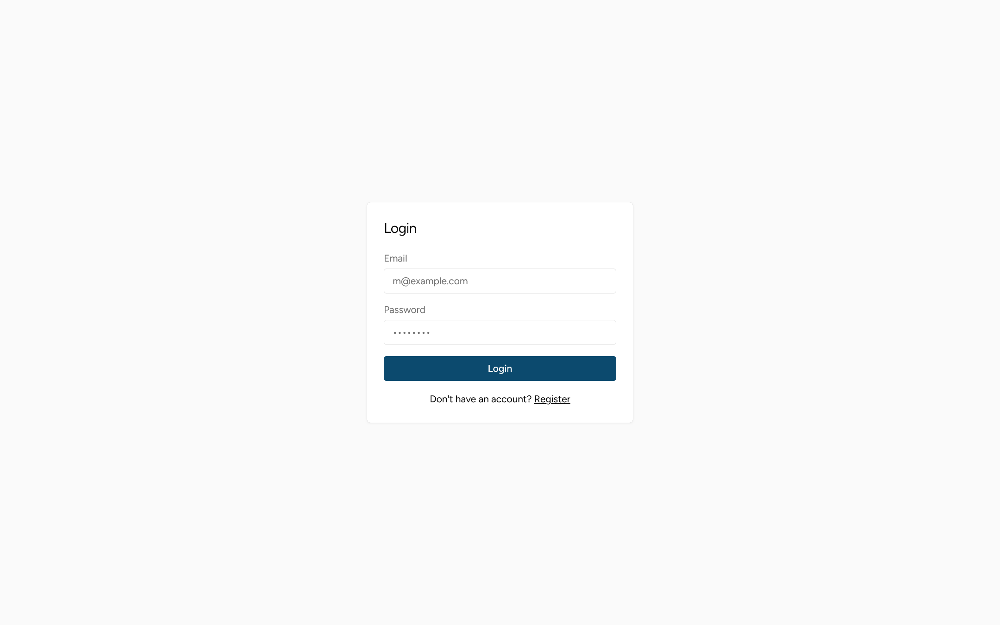
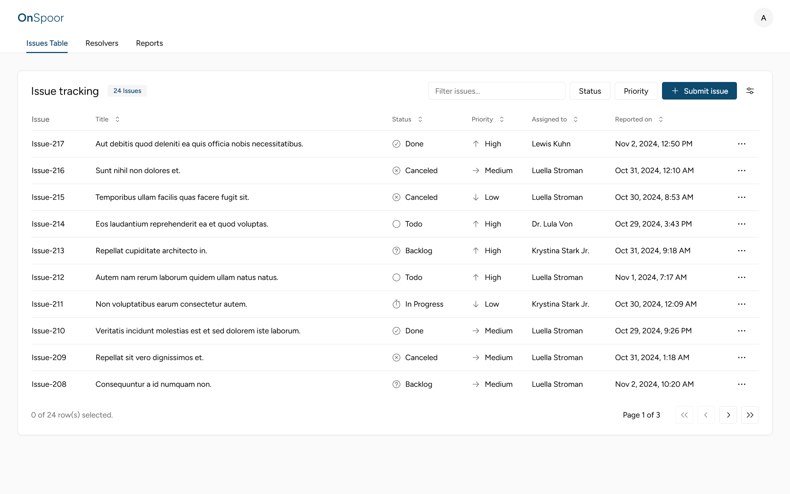
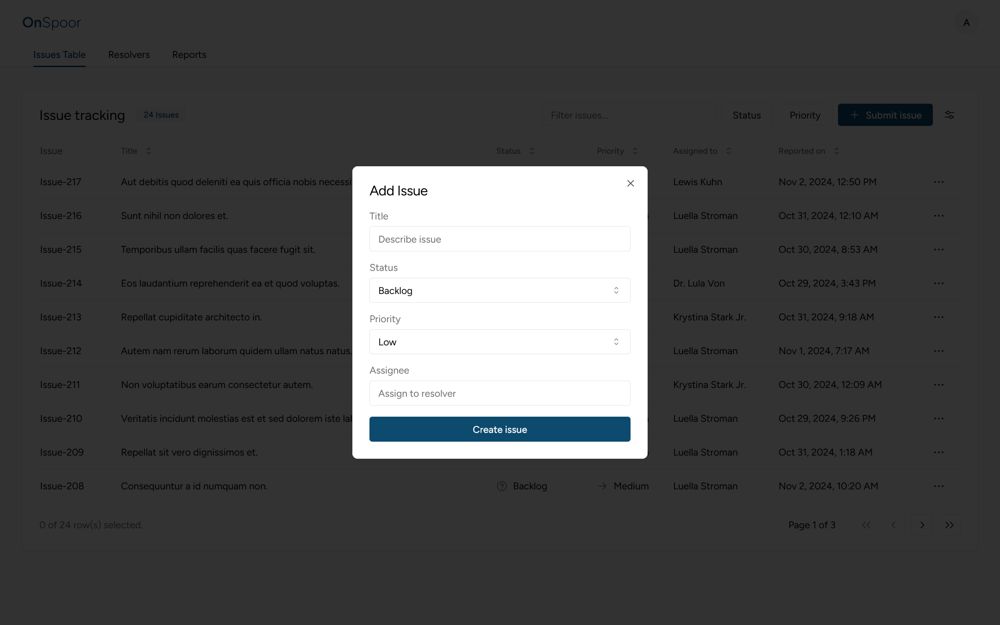

# Onspoor

> An issue tracking system that allows teams to report, track, and manage issues efficiently.

The Issue Tracker is a RESTful API-driven application built with Laravel and React. It provides tools for logging, assigning, prioritizing, and resolving issues across projects, enhancing collaboration and productivity within teams.

  
Table of Contents

  <ol>
    <li>
      <a href="#tech-stack">Tech Stack</a>
    </li>
    <li>
      <a href="#key-features">Key Features</a>
    </li>
    <li><a href="#meta">Meta</a></li>
  </ol>

## Tech Stack

This project was built using the following tech stack.

## Key Features

-   **RESTful API**:  
    A comprehensive RESTful API for seamless integration with third-party applications, enabling easy access and management of issue data.

-   **Authentication**:  
    Secure user authentication with Laravel Sanctum, featuring role-based access control for managing user permissions and ensuring data security.

-   **Issue CRUD Operations with Assignment**:  
    Full CRUD operations for issues, allowing users to create, update, and delete issues while assigning tasks to specific team members for streamlined collaboration.

-   **Visualization and Actions**:  
    Intuitive tools for sorting, filtering, and searching issues, making it easy for users to navigate tasks and prioritize their workflow effectively.

## Meta

Ayoub Bigharassine – [LinkedIn](https://www.linkedin.com/in/ayoub-bigharassine/) – ayoub.bigharassine@gmail.com
